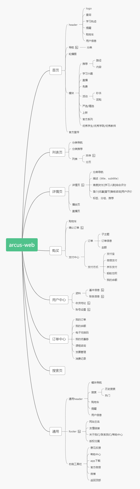

### 数据库

    内容管理：cms
    订单 oms
    商品 pms
    营销 sem
    会员 mms
    系统 sms
    
    
### 开发工具
    
    idea
    mysql
    redis
    Navicat for MySQL
    vscode
    maven
    
### 中间工具
    ffmpeg免安装
        https://ffmpeg.zeranoe.com/builds/
        解压后添加到环境变量
        
### 功能详解
#### pc web端

https://github.com/alibaba/flutter_boost

### 项目管理

https://github.com/Requarks/wiki